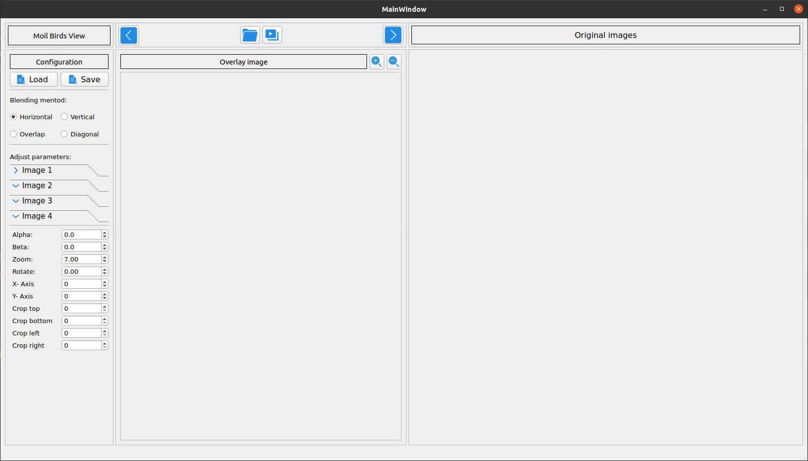
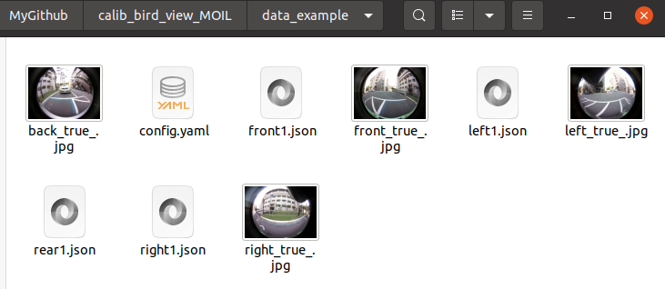
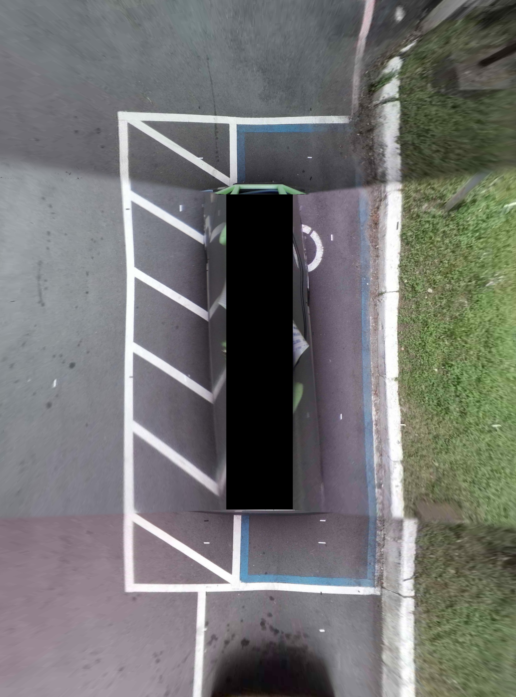

This Repository for calibration birds view using MOIL Method. the progress under developing. will update soon

### How to install
Please open this link to run this repository 

https://docs.google.com/presentation/d/1aq64koepGS7CWYBXGwLq8ILQDAso3-xLTCFfQcSFtZQ/edit?usp=sharing 

#### Clone Repository
1. Use this command to clone the repository
    ```
    git clone https://github.com/aji-ptn/Calibration_Bird_View_MOIL.git
    ```

2. Create virtual environment
   - Open your terminal in clone directory
   ```
   cd Calibration_Bird_View_MOIL
   ```
   - Create env using python 3.8
   ```
   python3.8 -m venv venv
   source venv/bin/activate
   ```
   - Install requirements
   ```
   pip install -r requirements.txt 
   ```
   
3. Run the program
   ```
   cd src
   python3 main.py
   ```



### Data Example
Open data example to image example in image save

#### 1. Image sources


#### 2. Image result
